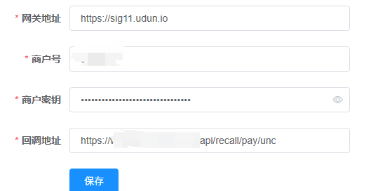
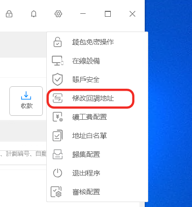
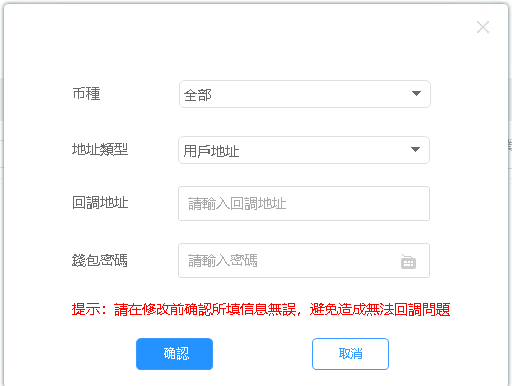

# 优盾接口api

# 1、后台配置优盾参数

- 管理后台配置优盾商户参数，具体如下：



- 优盾PC 客户端配置回调地址






# 2、后端配置


**充值请求**

`PUT请求`
`/setting/put/UDUN_SETTING`

```
{
    "gateway": "https://sig11.udun.io", //网关 
    "merchantId": "312031", //商户id 
    "merchantKey": "275476702cf57392cf1381fd2f332347",  //商户key
    "callbackUrl": "https：//ip:port/api/recall/pay/unc", //需要修改域名和端口 
	"enabled":true //是否开启 
}
```

2.配置 优盾提现地址
`PUT请求`
`/setting/put/THIRD_CHANNL`

```
[
    {
        "code": "301", //固定值
        "companyName": "unc",//固定值
        "key": "275476702cf57392cf1381fd2f332347",//商户key 
        "mechId": "312031",//商户id 
        "name": "unc",//固定值 
        "returnUrl": "https：//ip:port/recall/withdraw/unc",//需要修改域名和端口 
        "status": 0,// 0表示开启 
        "thirdPayStatu": "0",// 0表示开启 
        "url": "https://sig11.udun.io" // 网关地址  
    }
]
```


# 3、前端对接api

`GET请求`

`/api/recharge/getAdress?coin=${coin}&symbol=${symbol}`

`coin 币种标识`

`symbol 币种名称   `


## 打赏

如果该项目对您有所帮助，希望可以请我喝一杯咖啡☕️

```bash
# USDT-TRC20打赏地址:
TTz4y9EE5DqtRAneK5iQtWNW4k9E888888
```


## 声明

源码仅用于学习交流使用！

不可用于任何违反中华人民共和国(含台湾省)或使用者所在地区法律法规的用途。

因为作者即本人从未参与用户的任何运营和盈利活动。 

且不知晓用户后续将程序源代码用于何种用途，故用户使用过程中所带来的任何法律责任即由用户自己承担。            

```
！！！Warning！！！
项目中所涉及区块链代币均为学习用途，作者并不赞成区块链所繁衍出代币的金融属性
亦不鼓励和支持任何"挖矿"，"炒币"，"虚拟币ICO"等非法行为
虚拟币市场行为不受监管要求和控制，投资交易需谨慎，仅供学习区块链知识
```

