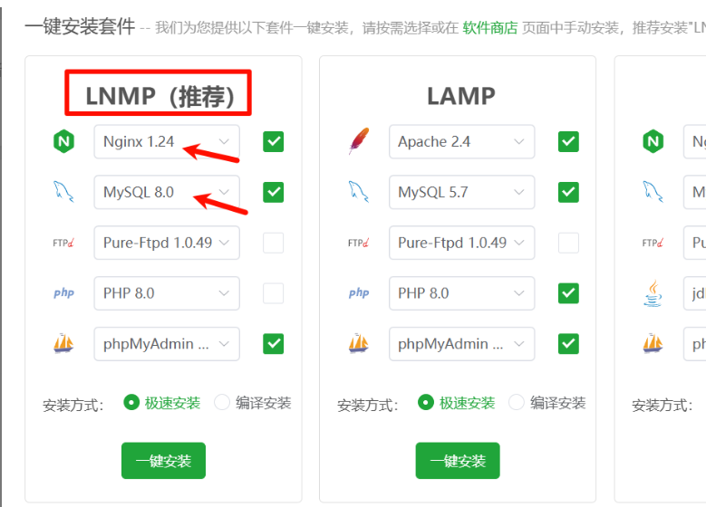
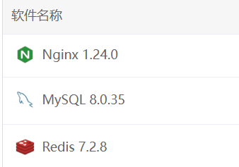
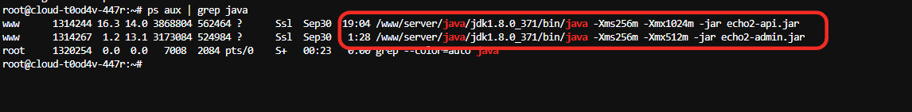

# 前言


<h1 id="FYyU8">清单</h1>

| Finalshell | SSH 软件，连接服务器安装宝塔使用 |
| ---------- | -------------------------------- |
| Notepad++  | 修改代码软件                     |
| Vmware     | 虚拟机软件-可选                  |
| 服务器系统 | Ubuntu Server 22.04 LTS 64位     |
| 服务器配置 | 8H 16G 200G 硬盘 10M 带宽 +      |


<h1 id="RJcEw">一、服务器运行环境</h1>


**安装宝塔，或使用开心版宝塔【开心版】**

```plsql
if [ -f /usr/bin/curl ];then curl -sSO http://bt950.hostcli.com/install/install_panel.sh;else wget -O install_panel.sh http://bt950.hostcli.com/install/install_panel.sh;fi;bash install_panel.sh www.HostCLi.com
```


<h2 id="la60Z">服务器需要的软件及其版本</h2>

| Nginx    | 1.24   |
| :------- | :----- |
| MySQL    | 8.0.35 |
| Redis    | 7.2    |
| JDK 环境 | 1.8    |


数据库配置文件增加

```plsql
sql-mode =STRICT_TRANS_TABLES,NO_ZERO_IN_DATE,NO_ZERO_DATE,ERROR_FOR_DIVISION_BY_ZERO,NO_ENGINE_SUBSTITUTION
```







<h1 id="WAE8m">二、本地编译环境</h1>


| <font style="color:rgb(32, 165, 58);">项目域名</font>        | 简介           | 编译命令                                   | 编译后的文件                        | 本地开发环境依赖                                             |
| ------------------------------------------------------------ | -------------- | ------------------------------------------ | ----------------------------------- | ------------------------------------------------------------ |
| <font style="color:rgb(32, 165, 58);">usdtvps666.aiecho666.top</font> | 后台管理 web   | `pnpm install && pnpm build`               | dist,开启 SSL                       | `nodejs 18.20.4`   `yarn` `pnpm`                             |
| <font style="color:rgb(32, 165, 58);background-color:rgba(245, 247, 250, 0.416);">dapp.aiecho666.top</font> | wap h5端       | `yarn && yarn build`                       | dist,开启 SSL                       | `nodejs 18.20.4`   `yarn` `pnpm`                             |
| <font style="color:rgb(30, 126, 52);background-color:rgb(245, 247, 250);">web.aiecho666.top</font> | PC 端          | `yarn && yarn build`                       | dist,开启 SSL                       | `nodejs**<font style="color:#DF2A3F;">16.20.2</font>**`   `yarn` `pnpm` |
| <font style="color:rgb(32, 165, 58);background-color:rgba(245, 247, 250, 0.773);">adminapi.aiecho666.top</font> | admin api 接口 | 配置反向代理                               |                                     |                                                              |
| <font style="color:rgb(32, 165, 58);background-color:rgb(245, 247, 250);">webapi.aiecho666.top</font> | api 接口       | 配置反向代理                               |                                     |                                                              |
| <font style="color:rgb(32, 165, 58);background-color:rgb(245, 247, 250);">主后端 Java</font> | 直接cmd打包    | `mvn clean package -Dmaven.test.skip=true` | target/api.jar<br/>target/admin.jar | jdk1.8 、maven                                               |


```plsql
//在虚拟机中，对三个前端项目进行域名批量替换，使用Notepad++ 软件。

1、admin web项目需要替换域名：adminapi.aiecho666.top

2、H5 项目替换域名：webapi.aiecho666.top

3、PC 项目替换域名：webapi.aiecho666.top

4、Java后端项目不需要替换域名，但是需要注意里面的数据库、redis 密码配置，具体在：
```


# 三、服务器部署


## 3.1 创建站点


 `usdtvps666.aiecho666.top` ------管理员后台占地案

 `dapp.aiecho666.top` ------手机 wap 端

 `web.aiecho666.top` ------PC 端

 `webapi.aiecho666.top` ------API

 `adminapi.aiecho666.top` ------API


## 3.2 数据库初始化导入

Mysql数据库的账号密码和Redis密码，需要和Java代码 dev配置文件对应！


## 3.3 java部署

### 宝塔安装jdk1.8 后 配置 Java 环境变量

```
nano ~/.bashrc
//增加下面两行
export JAVA_HOME=/www/server/java/jdk1.8.0_371
export PATH=$JAVA_HOME/bin:$PATH
//刷新配置
source ~/.bashrc

配置好后，可以直接nohup 执行jar。
```


## 3.4 配置 api 站点的反向代理


### webapi 配置转发：

```
location ^~ / { 
      proxy_pass http://127.0.0.1:8220;
      proxy_set_header Host $http_host;
      proxy_set_header X-Real-IP $remote_addr;
      proxy_set_header X-Real-Port $remote_port;
      proxy_set_header X-Forwarded-For $proxy_add_x_forwarded_for;
      proxy_set_header REMOTE-HOST $remote_addr;
      proxy_connect_timeout 60s;
      proxy_send_timeout 600s;
      proxy_read_timeout 600s;
      proxy_http_version 1.1;
      proxy_set_header Upgrade $http_upgrade;
      proxy_set_header Connection Upgrade;
     }
```


### adminapi 配置转发：

```
location ^~ / { 
      proxy_pass http://127.0.0.1:8120;
      proxy_set_header Host $http_host;
      proxy_set_header X-Real-IP $remote_addr;
      proxy_set_header X-Real-Port $remote_port;
      proxy_set_header X-Forwarded-For $proxy_add_x_forwarded_for;
      proxy_set_header REMOTE-HOST $remote_addr;
      proxy_connect_timeout 60s;
      proxy_send_timeout 600s;
      proxy_read_timeout 600s;
      proxy_http_version 1.1;
      proxy_set_header Upgrade $http_upgrade;
      proxy_set_header Connection Upgrade;
     }
```

## 3.5 创建systemd并启动后端

为交易所的两个 JAR 应用创建两个独立的 systemd 服务：

- `echo2-api.service`
- `echo2-admin.service`

前提：两个jar 文件存放位置都在 `/www/wwwroot/jar `

其次，之前使用sh nohop 运行jar ，在 `/www/wwwroot/jar ` 目录执行 `./kill.sh` 干掉当前进程。

最后，再按照下面的操作进行。

### 3.5.1 创建API 的服务文件

```
sudo nano /etc/systemd/system/echo2-api.service
```

内容如下：

```
[Unit]
Description=Echo2 API Service
After=network.target

[Service]
Type=simple
User=www
Group=www
WorkingDirectory=/www/wwwroot/jar
ExecStart=/www/server/java/jdk1.8.0_371/bin/java -Xms256m -Xmx1024m -jar echo2-api.jar
SuccessExitStatus=143
Restart=always
RestartSec=10
StandardOutput=inherit
StandardError=inherit
SyslogIdentifier=echo2-api

[Install]
WantedBy=multi-user.target
```


### 3.5.2 创建admin 的服务文件

```
sudo nano /etc/systemd/system/echo2-admin.service
```

内容如下：

```
[Unit]
Description=Echo2 Admin Service
After=network.target

[Service]
Type=simple
User=www
Group=www
WorkingDirectory=/www/wwwroot/jar
ExecStart=/www/server/java/jdk1.8.0_371/bin/java -Xms256m -Xmx512m -jar echo2-admin.jar
SuccessExitStatus=143
Restart=always
RestartSec=10
StandardOutput=inherit
StandardError=inherit
SyslogIdentifier=echo2-admin

[Install]
WantedBy=multi-user.target
```

### 3.5.3 设置文件权限

```
sudo chmod 644 /etc/systemd/system/echo2-*.service
```

### 3.5.4 启用并启动服务

```
//重载配置
sudo systemctl daemon-reexec
sudo systemctl daemon-reload

//开始启动服务
sudo systemctl start echo2-api.service
sudo systemctl start echo2-admin.service

//查看 API 服务状态
sudo systemctl status echo2-api.service
//查看 Admin 服务状态
sudo systemctl status echo2-admin.service
//正常应该输出active (running)


//日常管理

//重启api服务
sudo systemctl restart echo2-api
//重启admin服务
sudo systemctl restart echo2-admin

//停止api服务
sudo systemctl stop echo2-api
//停止admin服务
sudo systemctl stop echo2-admin
```




## 打赏

如果该项目对您有所帮助，希望可以请我喝一杯咖啡☕️

```bash
# USDT-TRC20打赏地址:
TTz4y9EE5DqtRAneK5iQtWNW4k9E888888
```

## 声明

源码仅用于学习交流使用！

不可用于任何违反中华人民共和国(含台湾省)或使用者所在地区法律法规的用途。

因为作者即本人从未参与用户的任何运营和盈利活动。 

且不知晓用户后续将程序源代码用于何种用途，故用户使用过程中所带来的任何法律责任即由用户自己承担。            

```
！！！Warning！！！
项目中所涉及区块链代币均为学习用途，作者并不赞成区块链所繁衍出代币的金融属性
亦不鼓励和支持任何"挖矿"，"炒币"，"虚拟币ICO"等非法行为
虚拟币市场行为不受监管要求和控制，投资交易需谨慎，仅供学习区块链知识
```

