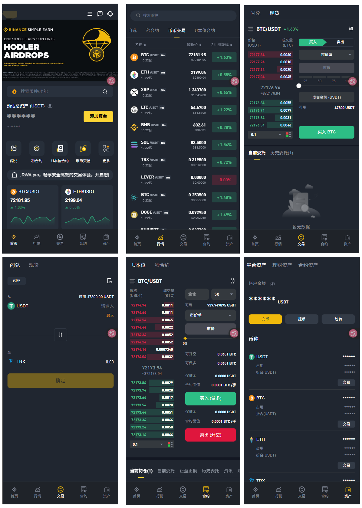

# Blockchain Exchange Development & Release Notes

This repository maintains the official development history and release notes for our blockchain exchange platform.

It documents the continuous evolution of the system, including:

- Core trading engine upgrades
- Security and compliance improvements
- User experience enhancements
- Infrastructure optimization
- API and ecosystem integrations
- New product launches
- Performance and scalability upgrades

By maintaining a transparent development log, we aim to provide our community, partners, investors, and users with clear visibility into the growth and progress of the platform.

Every significant update will be recorded and versioned to ensure accountability, traceability, and product transparency.




​	

#  更新日志 (Changelog)

本文件记录了交易所系统 2026年4月 重构大升级的详细变更内容。

---

## [重构大升级] - 2026-04

本次升级主要针对系统安全性、资金一致性及基础架构稳定性进行全方位重构，分为四个阶段逐步实施。

###  一期：核心安全加固

> 重点修复登录链路、越权访问及资金回调等高危风险。

- **[认证安全]** 修复登录与账户接管链路：钱包地址登录强制增加 `challenge` 签名校验，彻底禁止“仅凭地址登录”。
- **[权限控制]** 对象级授权（IDOR/BOLA）加固：对仓位、止盈止损、银行卡、后台审核/调账/KYC 等接口统一增加“资源归属校验 + 角色范围校验”。
- **[后台安全]** 封堵高危越权漏洞：针对充值/提现审核、调账、改密、拉黑、代理归属等操作，增加团队边界、审批链及不可越权的强校验。
- **[2FA 修复]** 处置 2FA 密钥泄露风险：下线匿名可访问的二维码/密钥接口，并完成历史密钥轮换。
- **[资金安全]** 强制化资金回调验签：充值/提现回调接口增加签名校验、时间窗校验及 `nonce` 防重放机制，校验失败直接拒绝。

### ️ 二期：资金一致性与逻辑优化
> 聚焦资金流转的幂等性、事务一致性及敏感数据处理。

- **[资金状态机]** 实现全链路幂等化：覆盖充值、提现、退款、结算、划转流程，引入幂等键与状态 CAS 机制，杜绝重复入账/退款/派奖。
- **[事务改造]** 提升事务一致性：将内部划转、结算、审核等资金动作改造为单事务或可靠补偿事务，防止中间态数据失衡。
- **[凭据治理]** 强化密码安全策略：移除 `123456` 等默认弱口令，改密接口强制绑定当前登录主体。
- **[日志脱敏]** 接入统一脱敏中间件：禁止打印 raw body、sign、证件号、手机号、地址及密钥等敏感信息。
- **[防重设计]** 前端高危操作防重：针对提现、下单、审核、保存等操作实施“按钮锁 + 服务端幂等”的双重防重复机制。
- **[URL 整改]** 敏感参数传输整改：禁止通过 URL 传递提现金额、2FA、验证码、密钥等敏感参数。

### ️ 三期：架构升级与依赖治理
> 优化密钥管理、Web 漏洞防护及运行环境稳定性。

- **[密钥管理]** 体系升级：移除配置与代码中的硬编码密钥，全面迁移至专业的密钥管理服务。
- **[XSS 治理]** 富文本安全防护：在公告、帮助中心、站内信等入口启用内容净化、输出编码与 CSP 策略。
- **[SSRF 防护]** 治理不安全 HTTP 工具：实施目标地址白名单机制，禁用 `trust-all SSL`，补齐证书与主机名校验。
- **[依赖治理]** 建立 SBOM 组件清单：升级高危依赖，移除高风险的 `system-scope` 本地 jar 包。
- **[稳定性]** 优化邀请码生成逻辑：将 `while(true)` 改为有限重试 + 兜底方案，避免高并发场景下的性能衰减。
- **[环境隔离]** 强化配置隔离：增加启动时环境校验，防止 dev 配置串用至生产环境。

###  四期：安全验证与回归测试
> 针对前述修复内容进行最终的可行性与残留风险验证。

- **[Druid 监控]** 验证监控台公网暴露与默认口令风险是否已彻底消除。
- **[XSS 验证]** 确认富文本存储型 XSS 漏洞是否已无法稳定触发。
- **[链路验证]** 验证 SSRF/LFI/MITM 工具链是否已阻断实际可利用路径。
- **[漏洞可达性]** 验证当前运行路径下的依赖漏洞是否可达（需进行可达性验证）。

---


## 声明

源码仅用于学习交流使用！

不可用于任何违反中华人民共和国(含台湾省)或使用者所在地区法律法规的用途。

因为作者即本人从未参与用户的任何运营和盈利活动。 

且不知晓用户后续将程序源代码用于何种用途，故用户使用过程中所带来的任何法律责任即由用户自己承担。            

```
！！！Warning！！！
项目中所涉及区块链代币均为学习用途，作者并不赞成区块链所繁衍出代币的金融属性
亦不鼓励和支持任何"挖矿"，"炒币"，"虚拟币ICO"等非法行为
虚拟币市场行为不受监管要求和控制，投资交易需谨慎，仅供学习区块链知识
```

