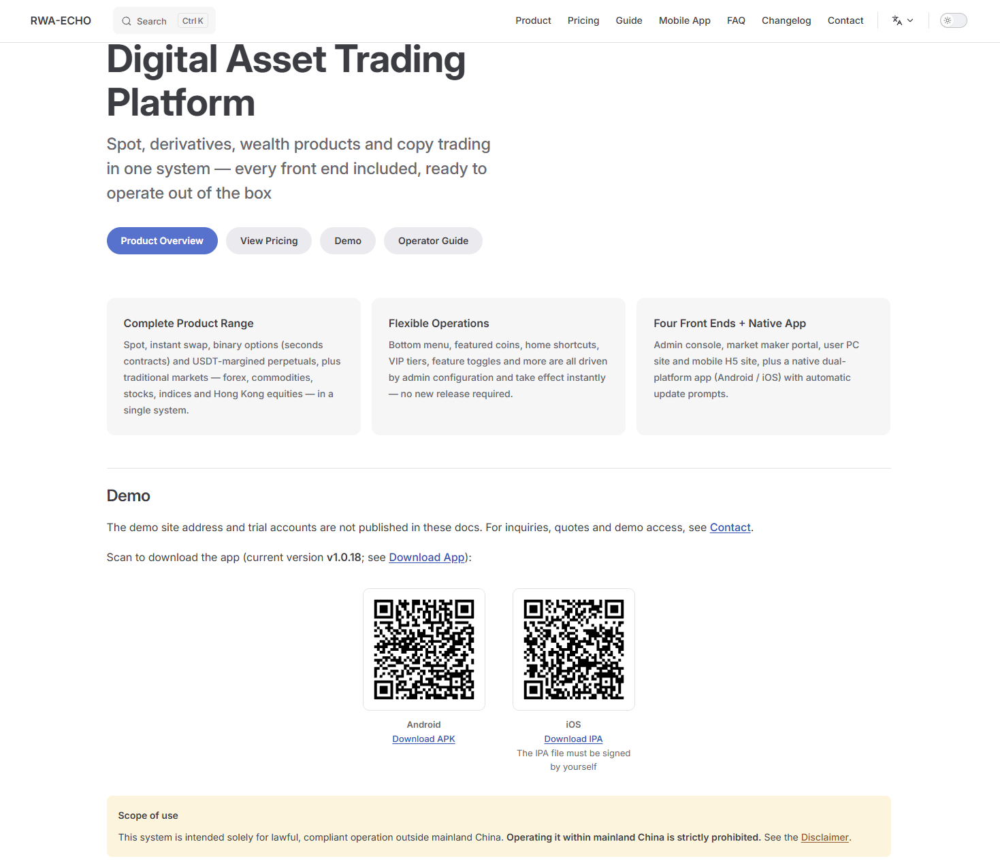
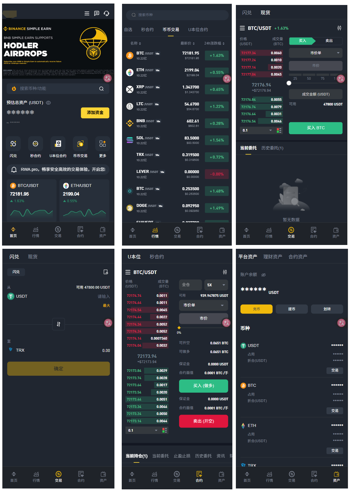
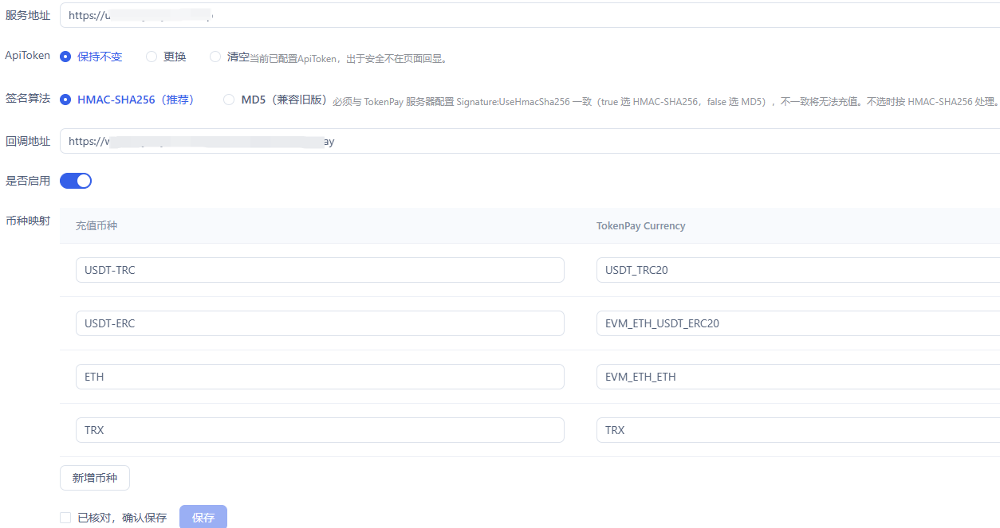
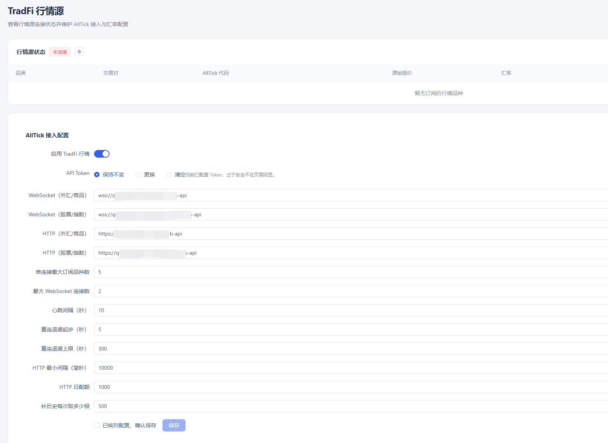

# Blockchain Exchange Development & Release Notes

This repository maintains the official development history and release notes for our blockchain exchange platform.

It documents the continuous evolution of the system, including:

- Core trading engine upgrades
- Security and compliance improvements
- User experience enhancements
- Infrastructure optimization
- API and ecosystem integrations
- New product launches
- Performance and scalability upgrades

By maintaining a transparent development log, we aim to provide our community, partners, investors, and users with clear visibility into the growth and progress of the platform.

Every significant update will be recorded and versioned to ensure accountability, traceability, and product transparency.

For more information about the system, please visit: https://rwadocs.bnbcode.com/




-------------

**The information below may not be up to date; for more details, please visit: https://rwadocs.bnbcode.com/**

**下面的资料可能不是最新的，了解更多请移步：https://rwadocs.bnbcode.com/**



#  更新日志 (Changelog)

### 2026/9/26

- 任意金额到账：对接支付服务新版能力，用户无需预先下单填额，链上实付多少即入账多少，减少因金额不符导致的掉单与人工补单。

- 资金入口多重核验：到账需依次通过签名校验、订单归属与收款地址一致性校验，并由平台主动向支付服务端二次核对后才入账；同一笔链上交易只会入账一次。签名算法升级为 HMAC-SHA256——更高级别的签名算法，进一步保障资金安全。

- 全端同步：网页、H5、App 三端同时上线，报错提示支持十余种语言。

- 充值体验升级：任意金额充值、到账自动提醒、地址有效期倒计时；充值记录中待支付的订单显示「--」，到账后显示实际数量

  

### V6.3.0 - 2026/8



- 行情与 K 线：接入 TradingView 专业图表，多周期切换、指标齐全；行情价格实时推送，K 线顶部报价已做到秒级更新
- 引入行情陈旧保护——数据源异常时不再采信过期价格
- 秒合约：下单 → 倒计时 → 自动结算全链路原生，倒计时以服务端定盘时刻为唯一基准，所见即真实结算时点
- U 本位永续合约：划转、开仓、持仓、平仓，市价/限价、盘口十档、实时盈亏一屏可见
- 币币现货 与 闪兑：两种交易方式并行，适配不同习惯的用户
- **TradFi（外汇 / 商品 / 股票 / 指数）**：在传统金融品类上提供与数字资产一致的交易体验，行情页优先呈现，品类 Tab 可由平台后台自由配置
- 资产总览、账户分布（现货 / 合约 / 理财分账户一目了然）、划转、充值、提现、充提记录、资金流水，**全部原生化**
- 充值页按币种正确标识 TRC20 / ERC20 / BEP20 等网络，从源头避免充错链
- 资产页完整展示全部持仓币种，金额显示统一优化：去掉冗余小数位，同时保留小额资产精度
- 理财（三分区）/ 质押 / DeFi / 助力贷 / 挖矿 全部原生页面
- 申购（打新）：项目列表、认购、订单与状态流转全流程原生
- 跟单 / 带单：输入跟单码一键跟投，带单员发码带单，全流程系统托管
- 注册 / 登录 / 找回密码：App 端具备完整的独立注册能力，无需再跳转网页
- 实名认证、邮箱认证、银行卡、条款协议、VIP 等级、在线客服全部原生化
- 网络层启用 HTTPS + HTTP/2，接口响应更快；异常信息不外泄，登录态失效即时识别并安全跳转
- 行情推送链路重做：连接状态实时自检、断线自动恢复，价格更新稳定连续
- 盘口挂单量按价格档位与真实量级重建，数据实际市场形态
- 合约、秒合约、TradFi 订单的分页、历史口径与币种名目全面对齐
- 整体视觉按主流交易所标准重做；时间、金额、小数位显示全局统一
- 每一轮迭代均在真实 Android 设备上逐屏验证后才发布
- 内置 7 种语言：简体中文、繁体中文、英语、日语、韩语、越南语、泰语。语言列表由后台控制，可按运营区域开关。
- APP 技术栈: Flutter 跨平台原生技术路线

### V6.2.0 - 2026/8/18

- 新增原生APP ，包含安卓和 IOS 平台，Flutter
- 运营后台新增 资产Tab设置
- 资产总览加「账户分布」，优化平台资产/ 理财资产 / 合约账户
- 原生 APP 重写 K线盘口

### V6.1.2 - 2026/8/2

- 新增玩法 —— 跟单码交易
- 用户端体验 优化—— 资产精确小数点、理财、合约下单、多语言

### V6.1.0 - 2026/7/20

- 支付与入金优化 —— 新增数字资产入金通道、专属地址、下单式充值、链上实收自动到账、网络标识修正 → 入金全自动闭环 + 双通道容灾
- 资金安全 —— 全面安全审计与加固：账户接入、资金原子化、权限边界、重复发放防护、密 钥治理、账号防护
- 交易稳定性 —— 行情失真防护、重复结算防护、订单不悬挂、倒计时对齐、横向扩展就绪

### V6.0.6 - 2026/6/15

- 入金新增 **TokenPay** 支付网关（后台与优盾二选一），支持每用户分配独立充值地址，自动归集指定冷钱包

### V6.0.6 - 2026/6/14

- 优化 H5 充值页 `recharge-apply-udun`

### V6.0.5 - 2026/6/10

- 修复 H5「我的投资」页「累计收益」：后端 `personalIncome()` 的 `sumEarn` 由 `sum(t_mine_order.accumula_earn)` 改为汇总用户全时段 `FINANCIAL_SETTLEMENT` 钱包流水（与「当日赚取」同一账本）。

### V6.0.5 - 2026/6/5

- 优化币币NPE和Redis Stream消费者组逻辑

### V6.0.4 - 2026/5/20

- 当前持仓数据显示优化
- 多语言显示问题修复
- dapp 接口关闭
- K 线socket 请求方式更新
- 涨跌幅数据显示优化

### V6.0.3 - 2026/5/8

- PC 合约订单优化
- 优盾充值参数 优化

### V6.0.1 - 2026/4/1

[重构大升级] - 2026-04

本次升级主要针对系统安全性、资金一致性及基础架构稳定性进行全方位重构，分为四个阶段逐步实施。

> 重点修复登录链路、越权访问及资金回调等高危风险。

- **[认证安全]** 修复登录与账户接管链路：钱包地址登录强制增加 `challenge` 签名校验，彻底禁止“仅凭地址登录”。
- **[权限控制]** 对象级授权（IDOR/BOLA）加固：对仓位、止盈止损、银行卡、后台审核/调账/KYC 等接口统一增加“资源归属校验 + 角色范围校验”。
- **[后台安全]** 封堵高危越权漏洞：针对充值/提现审核、调账、改密、拉黑、代理归属等操作，增加团队边界、审批链及不可越权的强校验。
- **[2FA 修复]** 处置 2FA 密钥泄露风险：下线匿名可访问的二维码/密钥接口，并完成历史密钥轮换。
- **[资金安全]** 强制化资金回调验签：充值/提现回调接口增加签名校验、时间窗校验及 `nonce` 防重放机制，校验失败直接拒绝。

> 聚焦资金流转的幂等性、事务一致性及敏感数据处理。

- **[资金状态机]** 实现全链路幂等化：覆盖充值、提现、退款、结算、划转流程，引入幂等键与状态 CAS 机制，杜绝重复入账/退款/派奖。
- **[事务改造]** 提升事务一致性：将内部划转、结算、审核等资金动作改造为单事务或可靠补偿事务，防止中间态数据失衡。
- **[凭据治理]** 强化密码安全策略：移除 `123456` 等默认弱口令，改密接口强制绑定当前登录主体。
- **[日志脱敏]** 接入统一脱敏中间件：禁止打印 raw body、sign、证件号、手机号、地址及密钥等敏感信息。
- **[防重设计]** 前端高危操作防重：针对提现、下单、审核、保存等操作实施“按钮锁 + 服务端幂等”的双重防重复机制。
- **[URL 整改]** 敏感参数传输整改：禁止通过 URL 传递提现金额、2FA、验证码、密钥等敏感参数。

> 优化密钥管理、Web 漏洞防护及运行环境稳定性。

- **[密钥管理]** 体系升级：移除配置与代码中的硬编码密钥，全面迁移至专业的密钥管理服务。
- **[XSS 治理]** 富文本安全防护：在公告、帮助中心、站内信等入口启用内容净化、输出编码与 CSP 策略。
- **[SSRF 防护]** 治理不安全 HTTP 工具：实施目标地址白名单机制，禁用 `trust-all SSL`，补齐证书与主机名校验。
- **[依赖治理]** 建立 SBOM 组件清单：升级高危依赖，移除高风险的 `system-scope` 本地 jar 包。
- **[稳定性]** 优化邀请码生成逻辑：将 `while(true)` 改为有限重试 + 兜底方案，避免高并发场景下的性能衰减。
- **[环境隔离]** 强化配置隔离：增加启动时环境校验，防止 dev 配置串用至生产环境。

> 针对前述修复内容进行最终的可行性与残留风险验证。

- **[Druid 监控]** 验证监控台公网暴露与默认口令风险是否已彻底消除。
- **[XSS 验证]** 确认富文本存储型 XSS 漏洞是否已无法稳定触发。
- **[链路验证]** 验证 SSRF/LFI/MITM 工具链是否已阻断实际可利用路径。
- **[漏洞可达性]** 验证当前运行路径下的依赖漏洞是否可达（需进行可达性验证）。

## 声明

源码仅用于学习交流使用！

不可用于任何违反中华人民共和国(含台湾省)或使用者所在地区法律法规的用途。

因为作者即本人从未参与用户的任何运营和盈利活动。 

且不知晓用户后续将程序源代码用于何种用途，故用户使用过程中所带来的任何法律责任即由用户自己承担。            

```
！！！Warning！！！
项目中所涉及区块链代币均为学习用途，作者并不赞成区块链所繁衍出代币的金融属性
亦不鼓励和支持任何"挖矿"，"炒币"，"虚拟币ICO"等非法行为
虚拟币市场行为不受监管要求和控制，投资交易需谨慎，仅供学习区块链知识
```

